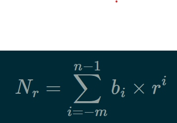

\section*{Sistemas Numéricos}
\subsection{Estructura superior del computador}

\textbf{La ALU}

Es la encargada de realizar las operaciones lógicas y aritméticas
sobre los datos. Lo realiza por medio de las compuertas lógicas (AND,
OR, NOT)

- Está conformada por dispositivos electrónicos que permiten el
  almacenamiento de dígitos binarios y ejecutar operaciones Booleanas
- La ALU se interconecta por señales de control, utiliza 2 registros y
  emite flags.
- Estas flags sirven para avisar si, por ejemplo, hubo un overflow
  porque el resultado no pùdo ser representado.

El computador interacciona con el medio a través de periféricos o
líneas de comunicación. Se compone de las siguientes partes:
- Central Processing Unit (CPU)
- Memoria principal
- Ingreso y salida de datos (I/O)
- Sistemas de interconexión

\textbf{El CPU}

Está conformado por registros, la unidad de control, la Unidad Lógica
Aritmética (ALU) y el CPU de interconexión interna.

A su vez, la unidad de control se forma por circuitos secuenciales,
registros y decodificadores y la memoria de control. 

\subsection{Que es un número?}
Un número se refiere a una cadena de dígitos en donde la posición de
cada uno determina la base con la que se esté trabajando. Por ejemplo,
en el número 314.56:
- El 3 ocupa la base 2
- El 1 ocupa la base 1
- El 4 ocupa la base 0
- El 5 ocupa la base -1
- El 6 ocupa la base -2
De esta forma, la posición del número posee un peso r^{i}, donde r es
la base del sistema de numeración.

Por lo tanto, un número N en base r se expresa como:

#+caption: SistemasNumeracion
#+attr_latex: :scale 0.75
#+label: fig:numeros
      

\textbf{Número en base 7: 345}

\textbf{Número en base 4: 12}

El valor correspondiente al número 345 en base 7 es 180. Por otro
lado, el valor correspondiente al número 12 en base 4 es 6.

Recordar que, en el caso del sistema de numeración decimal, la base
$$r = 10$$

